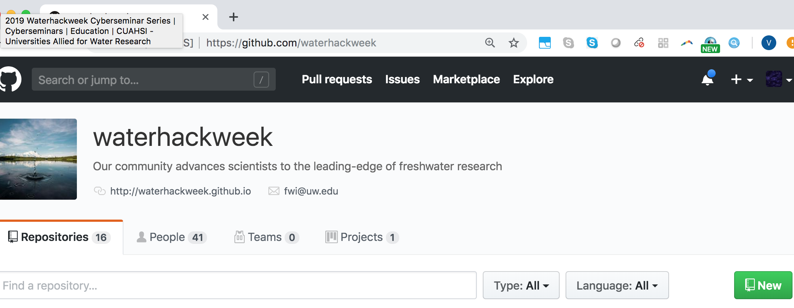
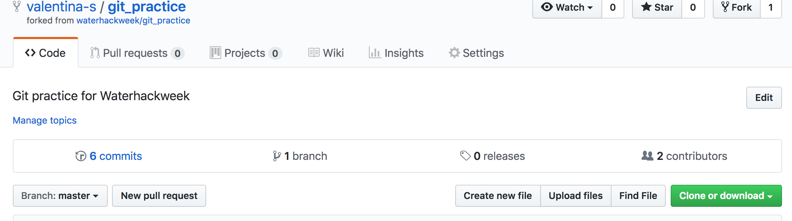
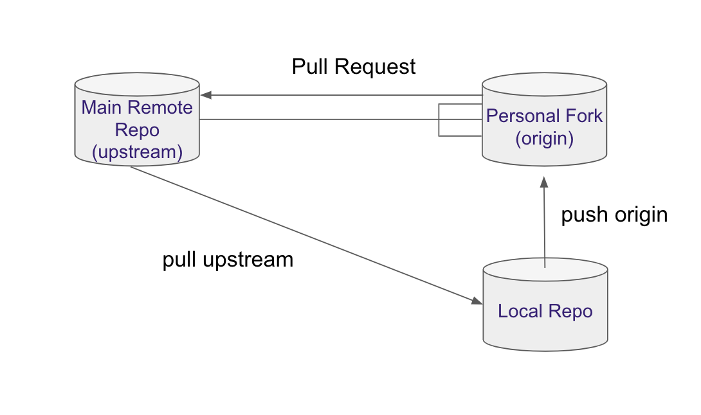

# Git&GitHub Guide

Prerequisites:

* Watched the lecture WaterHackWeek CyberSeminar: 
[Version Control with Git and Github Video](https://www.youtube.com/watch?v=Bc5BO9gPC9w&feature=youtu.be)
[https://www.cuahsi.org/education/cyberseminars/waterhackweek-cyberseminar-series/](https://www.cuahsi.org/education/cyberseminars/waterhackweek-cyberseminar-series/)

* Set up git on your laptop and have your `github.com` account. 

	Installation instructions: [https://carpentries.github.io/workshop-template/#git](https://carpentries.github.io/workshop-template/#git)
	
	Test set-up by typing `git` in the terminal (Git-Bash on Windows)
	

* Have joined the Waterhackweek Github Organization.


## Creating a project repository

One person on your team should volunteer and create a repository for the project under the Waterhackweek organization.

https://github.com/waterhackweek



Click New and follow the steps: check yes to create Readme.md

* Format project name as whw2019_ourproject (you can change the name later)
* Invite others to the repo:
	* Settings -> Collaborators
	* Note to collaborators: you will receive an invitation to your email associated with github.com. If you cannnot find it look for the `bell` notifications on the top right of the website.

## Cloning the repository.

Each participant should clone the repository so they have their local copy. Navigate through the terminal to the folder where you want to keep Waterhackweek work. (`cd path_to_waterhackweek`)

```
git clone www.github.com/waterhackweek/whw2019_ourproject/ 
```

This will create a new folder called whw2019_ourproject. Navigate to the folder.

## Updating the Readme with your name.

Open the Readme.md file with your favorite editor and add your name to the file (on a separate line).

Then add this change, commit it to the local repository, and publish it on the github.com website.

```
git add Readme.md
git commit -m "Adding Valentina's name to Readme.md"
git push origin
```

Make sure your change appears online.

! Remember to run 

``` 
   git status

```
to observe the changes made into the your repository.

Pay attention to the colors.

To see the changes in the files run:

```
git diff 

```

## Updating your local repository with the changes of your collaborators. 

```
  git pull origin master

```


! Remember `origin` is just a short name of the web address of the repository.

To see the what is hidden in origin:

```
   git remote -v 

```

To practice these steps more, make more changes to the title and the description of the project.

*Ran into a problem?*

When working with several people sometimes you

* cannot push because changes have been made that have not been incorporated: need to first pull

* when pulling you arrive into a merge conflict: need to resolve the conflict manually


## Resolving the merge conflict

```
git status
```


You will see the file/s which caused the merge conflict in green.

Open it and decide which changes you want to keep. Modify the file so it looks as you wish. Remove the arrows. Commit and publish the changes.

```
git add Readme.md
git commit -m "resolving merge conflict"
git push origin
```

You can continue working on as usual.


! Remember to pull often and push small changes to avoid messing with complicatd merges and keep your repo up-to-date.


## Avoiding problems: forking workflow.

Some merge conflicts can be avoided by working with Forks.

Forks are public copies of the main repo, from which  

* Sync your local repo with the public one
* Fork the public repo
	* Note it looks the same but the web address contains your username	
* Go to your local repo and rename your origin to point to the fork:

```
git remote rm origin
git remote add origin www.github.com/valentina-s/whw_2019_ourproject
```

* Add a new remote to talk to the main repo:

```
git remote add upstream www.github.com/waterhackweek/ourproject 
```

From now on you push to origin, but you pull from upstream.


! Make sure your origin contains your github username, and upstream contains the waterhackweek name.


## Submitting changes via a pull request

Make some changes to a file and commit and publish them.

```
git add Readme.md
git commit -m "more changes"
git push origin master
```

! Note they appear on your fork, but not on the main repo.

Submit a pull request by clicking `New pull request`:



* Explain what changes you have made.
* Assign somebody for review.

* Reviewer: look through changes in the files
* Approve PR or ask for more changes.

! Note: while your pull request is pending, any change you push to the fork will become a part of the request. This is useful if you are asked to make small changes before your PR is accepted.

From now on we encourage individual members to use forks, and submit changes to the main repo with pull requests.




## Version control and Jupyter notebooks

* `git diff` gives rubbish on notebooks
	* notebooks are text files, but the information is stored in json format

* split analysis in small notebooks, individual people working on individual notebooks, put longer code into functions and keep move functions to modules (.py files which work well with version control). 

* before committing clear output notebook output
(images are stored in very long strings of crazy characters)

* you can use jupyterlab (supports both notebooks and scripts)

	```
	   jupyter lab
	```

* nbdime: tool to diff notebooks [https://nbdime.readthedocs.io/en/latest/](https://nbdime.readthedocs.io/en/latest/)


## Git and JupyterHub


You can access the terminal on Jupyter Hub. From there you can use git and commit your work.


## Troubleshooting

* Deleting files
* Resetting to an older version


## Structuring the repo


Data Science Projects:

[https://drivendata.github.io/cookiecutter-data-science/#cookiecutter-data-science](https://drivendata.github.io/cookiecutter-data-science/#cookiecutter-data-science)

Software Packages Projects:

[https://github.com/uwescience/shablona](https://github.com/uwescience/shablona)

## Adding a license

Discuss with your teammates what license you will use for your code: [https://choosealicense.com/](https://choosealicense.com/)


## References:

* Software Carpentry Lesson:
	* 	[http://swcarpentry.github.io/git-novice/](http://swcarpentry.github.io/git-novice/)


